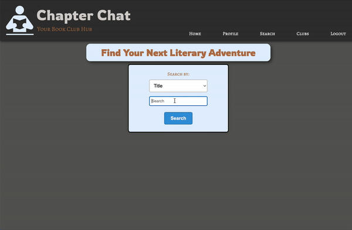

## Chapter Chat
Explore our user-friendly website to discover, catalog, and share your reading journey. Build your 'to-be-read' and 'completed' book lists, and connect with others to swap recommendations. Engage in book clubs, where you can create or join discussions on dedicated message boards. Compete for the top spot on the leaderboard by tracking the number of pages completed.

Visit Chapter Chat [Here](http://13.58.134.186/)




### Tools and Technologies


  

<br/><br/>
### Installation
To run this on your local machine please follow the instructions below:

- This project is containerized using docker to reduce dependency issues so docker must be installed and running on your local machine. [Docker installation](https://www.docker.com/get-started/)

1. Run the command below from the projects root directory to allow execute permissions

```
chmod 755 run-compose-dev.sh
```

2. Now, run the file that execute permissions were given to in the first step

```
./run-compose-dev.sh
```

3. Navigate to `localhost:80` in your browser


### Feature Wishlist 

This project was built over the course of 4 weeks so naturally we could not implement every feature we imagined. 

- Searchable user base
- Message board notifications
- More responsive design
- More robust authentication
